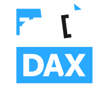

# DAX Studio

<!-- markdownlint-disable MD033 MD045 -->

    

The **ultimate** tool for working with [Data Analysis Expressions (DAX)](https://learn.microsoft.com/en-us/dax/) queries.

## Feature

### Easy to Use

`DAX Studio` was designed with a clean, modern user interface that supports both a light and dark mode and provides rich metadata about your data model.

### Connect to any data model

`DAX Studio` can connect to all the different 'flavours' of tabular models PowerPivot for Excel, Power BI Desktop, Azure Analysis Services and Power BI Premium XMLA endpoints.

### Powerful performance tuning tools

You can use features like Server Timings, View Metric and Benchmarking to profile and understand the performance of your DAX code.

## Documentation

If this is your first time using `DAX Studio` the [tutorials](https://daxstudio.org/docs/category/tutorials/) are a great place to get started.

If you want to understand the different options you have when installing `DAX Studio` those are documented [here](https://daxstudio.org/docs/installation/index/).

If you want to find out about specific features you can read through the [Features](https://daxstudio.org/docs/features/intro/) section.

If you have a question about `DAX Studio` you can ask on our [Github Discussions](https://github.com/daxstudio/daxstudio/discussions) page.

If you think you are encountering a bug or would like to suggest a new feature you can log an [issue on Github](https://github.com/daxstudio/daxstudio/issues).

## Building

All of the dependencies for `DAX Studio` are available as nuget packages, so doing a nuget restore should be enough to build this solution in Visual Studio 2022.

When preparing to make changes in order to submit a pull request you should create a feature branch off the `develop` branch. The develop branch contains the current development build of the code including any new features. The master branch only contains the code for the last stable release.

We merge from develop to master when doing a public release.

See the following for details about [debugging](./docs/debugging.md) `DAX Studio`.
